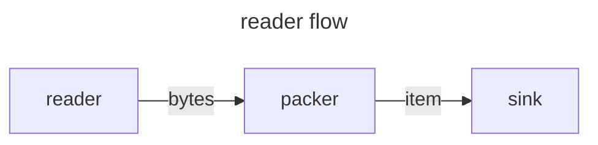
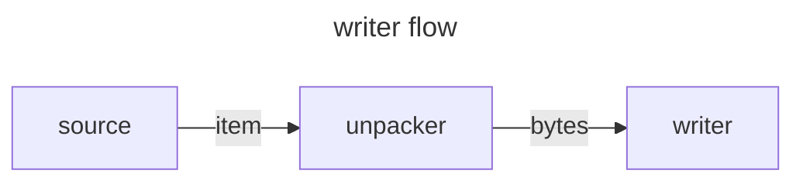

# ly.communicating

```mermaid
---
title: reader flow
---
flowchart LR
	reader -->|bytes| packer
	packer -->|item| sink
```

```mermaid
---
title: writer flow
---
flowchart LR
	source -->|item| unpacker
	unpacker -->|bytes| writer
```
